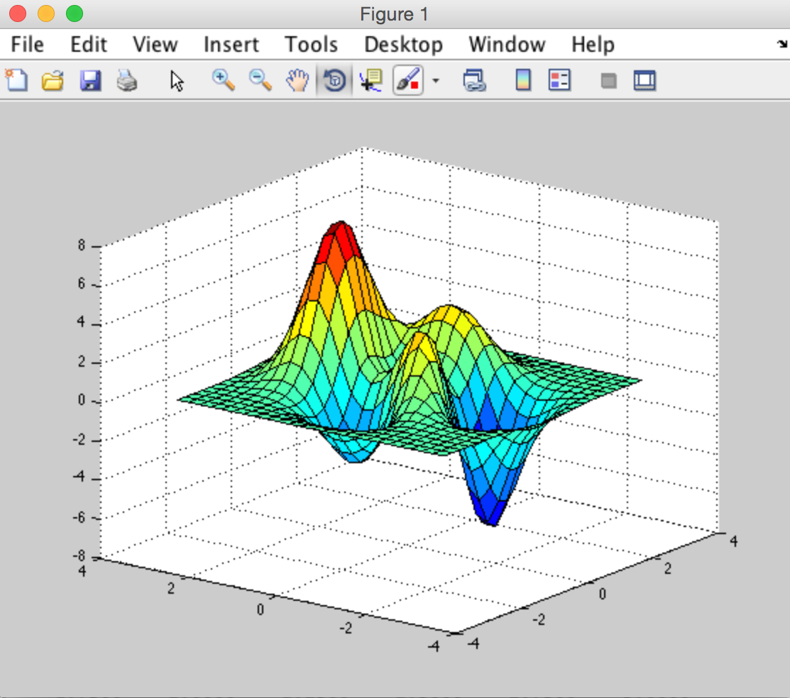

## reach 0.4.5
##### Added Microsoft Windows support
- added Windows support for ```runMatlabFct()```, ```runMatlabCommand()``` and ```runMatlabScript()```
- Windows support was successfully tested on Microsoft Windows 7 Professional running Matlab R2014a 
- Windows support was successfully tested on Microsoft Windows 10 Home running Matlab R2016a


##### Features currently in development
- future releases of 'reach' will be able to read and write Matlab -v7.3 mat-files (HDF5); actually 'reach' will be able to transparently read -v7 / -v7.3 Matlab files
- future releases of 'reach' will wrap generated Matlab code in try-catch blocks so that the Matlab process will automatically terminate in case of encountered errors


## reach 0.4.2
- new ```matWrite()``` function for conveniently writing .mat files and correctly writing .mat files containing logicals and atomic vectors
- ```matWrite()``` replaces R.matlab::writeMat() in ```runMatlabFct()```
- ```runMatlabFct()``` uses temporary .mat files with random names (instead of fixed names) for data transfer to Matlab, making running several instances of this function robust against overwriting these files
- ```runMatlabFct()``` will now throw an error if Matlab function input arguments are named like 'writeMat()' options, which cannot be written to .mat files and thus cannot be exported to Matlab this way
- ```convert2RData()``` was rewritten and the way it is used changed slightly. Sorry for the inconvenience.


## reach 0.3.1
- fixed: temporary files were not removed by ```runMatlabFct()``` under certain circumstances
- ```runMatlabScript()``` now complains if the input Matlab script does not exist in the current working directory, therefore one does not have to wait for Matlab to throw the error
- the ```rList2Cell()``` Matlab function is now also bundled with the R package in inst/matlab/


## reach 0.3.0
- reach can now seamlessly call Matlab functions and return their results directly using ```runMatlabFct()```
- to give an example:
    
    ```
    a       <- c(1,2,1,4,1,5,4,3,2,2,1,6,3,1,3,5,5)
    b       <- c(4,6,9)
    results <- runMatlabFct( "[bool, pos] = ismember(b,a)" )
    ```

    returns the following results

    ```
    > results
    $bool
         [,1]
    [1,]    1
    [2,]    1
    [3,]    0

    $pos
         [,1]
    [1,]    4
    [2,]   12
    [3,]    0
    ```

    Plots using Matlab are possible, too:

    ```
    p <- runMatlabFct( "[X,Y,Z] = peaks(25)" )
    X <- p$X
    Y <- p$Y
    Z <- p$Z
    runMatlabFct( "surf(X,Y,Z)" )
    ```

    